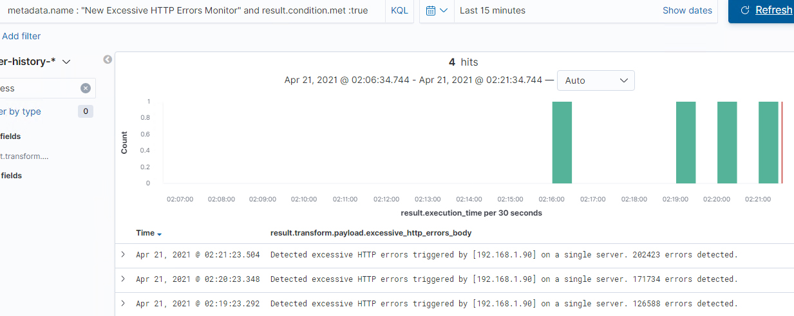
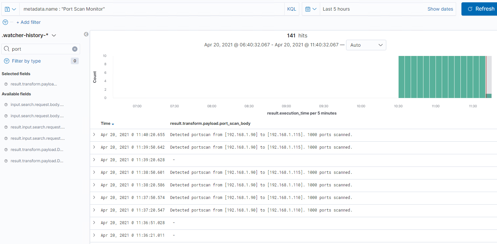

# Blue Team: Summary of Operations

## Table of Contents
- Network Topology
- Description of Targets
- Monitoring the Targets
- Patterns of Traffic & Behavior
- Suggestions for Going Further

## Network Topology


The following machines were identified on the network:

- ML-RefVm-684427  
  - **Operating System**: Windows 10 pro 
  - **Purpose**: Hypervisor and Gateway
  - **IP Address**: 192.168.1.1
- Kali
  - **Operating System**: Kali GNU/Linux Rolling 2020.1
  - **Purpose**: Attack machine
  - **IP Address**: 192.168.1.90
- ELK
  - **Operating System**: Ubuntu 18.04.4 LTS (bionic)
  - **Purpose**: Monitoring (Elasticsearch)
  - **IP Address**: 192.168.1.100
- Capstone (server1)
  - **Operating System**: Ubuntu 18.04.1 LTS (bionic)
  - **Purpose**: Alert testing
  - **IP Address**: 192.168.1.105
- Target1
  - **Operating System**: Debian GNU/Linux 8.11 (jessie)
  - **Purpose**: Victim
  - **IP Address**: 192.168.1.110
- Target2
  - **Operating System**: Debian GNU/Linux 8.11 (jessie)
  - **Purpose**: Victim
  - **IP Address**: 192.168.1.115


## Description of Targets

The target of this attack was: `Target 1` (192.168.1.110).

Target 1 is an Apache web server and has SSH enabled, so ports 80 and 22 are possible ports of entry for attackers. As such, the following alerts have been implemented:

## Monitoring the Targets

Traffic to these services should be carefully monitored. To this end, we have implemented the alerts below:

### HTTP Request Size Monitor

HTTP Request Size Monitor is implemented as follows:
  - **Metric**: Sum of http.request.bytes over all documents in the last 1 minute
  - **Threshold**: Greater than 3500
  - **Vulnerability Mitigated**: Denial of service attacks, brute force password attacks, brute force website URI scans; exclusively over HTTP.
  - **Reliability**: The reliability of this alert is medium. It has not caused any false positives or negatives in our test. However, in a production environment, false positives are definitely possible with this alert.


  We observe the alert firing while testing it by running Gobuster.

  

  During the penetration test, we observe that this alert is firing at times when Gobuster and other scans were executed. We do not observe false positives.

  

  
   Since there are multiple web servers on this network, not to mention the fact that a single busy web server will be recieving large numbers of legitimate requests from multiple clients, this alert has no chance of reliability without first using aggregation logic to only alert when a large number of requests occur from a specific source IP and/or a specific destination IP. Therefore, an advanced alert is required to achieve the desired result.

###  Excessive HTTP Errors
Excessive HTTP Errors is implemented as follows:
  - **Metric**: The sum of 'http.response.status_code' grouped by top 5 in the last 5 minutes
  - **Threshold**: Greater than 400
  - **Vulnerability Mitigated**: Brute force website URI scans.
  - **Reliability**: The reliability of this alert is medium. It has not caused any false positives or negatives in our test. However, in a production environment, false positives are definitely possible with this alert.

We observe the alert firing while testing it by running Gobuster.


During the penetration test, we observe that this alert is firing at times when Gobuster and other scans were executed. We do not observe false positives.


Despite the lack of IP filtering in this alert not causing false positives in this test, it still has the potential to cause false positives for the same reasons outlined above for the HTTP Request Size Monitor alert. Therefore, in order for this alert to achieve the desired result, it must be an advanced alert, with aggregation logic to group by specific source and/or destination IP address.


###  New Excessive HTTP Errors
New Excessive HTTP Errors is implemented as follows:
  - **Metric**: The count of http.response.status_code >= 400 for a scpecific source IP, accessing a specific destination IP, in the last 5 minutes
  - **Threshold**: Greater than 400
  - **Vulnerability Mitigated**: Brute force website URI scans.
  - **Reliability**: The reliability of this alert is medium because does not generate false positives. It is unlikely to produce false negatives because any meaningful brute force URI scan would take a very long time if it has to run slower than 100 tests a minute.

  We redesigned the Excessive HTTP Errors alert to fix the issues outlined for the original version above. By grouping the counts by source IP and destination IP we can Identify the offending attacker IP (assuming the attack is not distributed). This allows us to include the IP in the logs, allowing action to be taken without manually searching for the origin of the attack.


  We tested this alert by scanning a target with Gobuster and confirming the scan triggered the alert.

  

  The command and JSON used to create this alert was:


<!--  ```bash
PUT _watcher/watch/excessive_http_errors_monitor_a
{
  "metadata" : {
    "name" : "New Excessive HTTP Errors Monitor",
    "description" : "This is a HTTP request size watcher.",
    "threshold" : 400
  },  
  "trigger": {
    "schedule": {
      "interval": "1m"
    }
  },
  "input": {
    "search": {
      "request": {
        "indices": [
          "packetbeat-*"
        ],
        "body": {
          "size": 0,
          "query": {
            "bool": {
              "must": [
                {
                  "range" : {
                    "http.response.status_code" : {
                      "gte" : 400
                    }
                  }
                },
                {
                  "range": {
                    "@timestamp": {
                      "gte": "now-5m"
                    }
                  }
                }
              ]
            }
          },
          "aggs": {
            "by_src_ip": {
              "terms": {
                "field": "source.ip"
              },
              "aggs": {
                "count_target_ip": {
                  "value_count": {
                    "field": "destination.ip"
                  }
                }
              }
            }
          }
        }
      }
    }
  },
  "condition": {
    "script": {
      "source": "for (int i = 0; i < ctx.payload.aggregations.by_src_ip.buckets.size(); i++) {if (ctx.payload.aggregations.by_src_ip.buckets[i].count_target_ip.value >= ctx.metadata.threshold) return true;}return false;"
    }
  },
      "transform": {
        "script": {
          "source": "def target='';def attacker='';def transform_body='excessive_http_errors_body';def body='';for (int i = 0; i < ctx.payload.aggregations.by_src_ip.buckets.size(); i++) {if (ctx.payload.aggregations.by_src_ip.buckets[i].count_target_ip.value >= ctx.metadata.threshold) {attacker=ctx.payload.aggregations.by_src_ip.buckets[i].key;body='Detected excessive HTTP errors triggered by ['+attacker+'] on a single server. '+ctx.payload.aggregations.by_src_ip.buckets[i].count_target_ip.value+ ' errors detected.'; return [ transform_body : body ]}}"
        }
      },
  "actions": {
    "log"     : {
      "logging" : {
        "text" : "WARNING: {{ctx.payload.excessive_http_errors_body}}"
      }
    }
  }
}  
  ``` -->


### CPU Usage Monitor
CPU Usage Monitor is implemented as follows:
  - **Metric**: The maximum system.process.cpu.total.pct over all documents in the last 5 minutes.
  - **Threshold**: Greater than 0.5
  - **Vulnerability Mitigated**: Large filesystem searches, URI scanning, Brute force attacks.
  - **Reliability**: The reliability of this alert is high. It does not produce false positives or negatives.

We observe the alert firing while testing it by running Gobuster.


During the penetration test, we observe that this alert is firing at times when Gobuster and other scans were executed. We do not observe false positives.


### Port Scan Monitor
Port Scan Monitor is implemented as follows:
  - **Metric**: The number of unique ports accessed on a scpecific destination IP, by a specific source IP, in the last minute.
  - **Threshold**: greater than or equal to 60
  - **Vulnerability Mitigated**: Port scanning
  - **Reliability**: The reliability of this alert is medium because it is unlikely to generate false positives. There are few legitimate reasons for a client to access over 60 ports inside a 1 minute window. It is also unlikely to produce false negatives, as 60 ports per minute is the threshold for detecting an Nmap scan in polite mode. However, it will not detect Nmap scans in sneaky or paranoid mode and it will not detect a distributed port scan from a bot net.

In our testing, we confirmed that this alert is triggered when port scanning the target machines and did not trigger otherwise.



We tested this alert using an NMap scan with -T1 (stealth mode) and, as expected, it did not fire.


Increasing the timestamp range significantly would catch this type of scan too. However, this should be done as a seperate alert that has a much longer trigger interval, because running a much larger timestamp range frequently will put excessive load on the ELK server.

Because we have grouped by source and destination IP, we can include the IP addresses involved in the log, allowing action to be taken without manually searching for the origin of the attack.


  The command and JSON used to create this alert was:


  <!--```bash
PUT _watcher/watch/port_scan_monitor_a
{
  "metadata" : {
    "name" : "Port Scan Monitor",
    "description" : "This is a port scan watcher.",
    "threshold" : 60
  },  
  "trigger": {
    "schedule": {
      "interval": "30s"
    }
  },
  "input": {
    "search": {
      "request": {
        "indices": [
          "packetbeat-*"
        ],
        "body": {
          "size": 0,
          "query": {
            "bool": {
              "must": [
                {
                  "range": {
                    "@timestamp": {
                      "gte": "now-1m"
                    }
                  }
                }
              ]
            }
          },
          "aggs": {
            "by_src_ip": {
              "terms": {
                "field": "source.ip"
              },
              "aggs": {
                "by_target_ip": {
                  "terms": {
                    "field": "destination.ip",
                    "order": {
                      "unique_port_count": "desc"
                    }
                  },
                  "aggs": {
                    "unique_port_count": {
                      "cardinality": {
                        "field": "destination.port"
                      }
                    }
                  }
                }
              }
            }
          }
        }
      }
    }
  },
  "condition": {
    "script": {
      "source": "for (int i = 0; i < ctx.payload.aggregations.by_src_ip.buckets.size(); i++) {for (int j = 0; j < ctx.payload.aggregations.by_src_ip.buckets[i].by_target_ip.buckets.size(); j++) {if (ctx.payload.aggregations.by_src_ip.buckets[i].by_target_ip.buckets[j].unique_port_count.value > ctx.metadata.threshold) return true;}}return false;"
    }
  },
      "transform": {
        "script": {
          "source": "def target='';def attacker='';def transform_body='port_scan_body';def body='';for (int i = 0; i < ctx.payload.aggregations.by_src_ip.buckets.size(); i++) {for (int j = 0; j < ctx.payload.aggregations.by_src_ip.buckets[i].by_target_ip.buckets.size(); j++) {if (ctx.payload.aggregations.by_src_ip.buckets[i].by_target_ip.buckets[j].unique_port_count.value >= ctx.metadata.threshold) {target=ctx.payload.aggregations.by_src_ip.buckets[i].by_target_ip.buckets[j].key;attacker=ctx.payload.aggregations.by_src_ip.buckets[i].key;body='Detected portscan from ['+attacker+'] to ['+target+']. '+ctx.payload.aggregations.by_src_ip.buckets[i].by_target_ip.buckets[j].unique_port_count.value+ ' ports scanned.'; return [ transform_body : body ]}}}"
        }
      },
  "actions": {
    "log"     : {
      "logging" : {
        "text" : "WARNING: {{ctx.payload.port_scan_body}}"
      }
    }
  }
}  
  ```-->

<!-- 

### Suggestions for Going Further (Optional)
_TODO_: 
- Each alert above pertains to a specific vulnerability/exploit. Recall that alerts only detect malicious behavior, but do not stop it. For each vulnerability/exploit identified by the alerts above, suggest a patch. E.g., implementing a blocklist is an effective tactic against brute-force attacks. It is not necessary to explain _how_ to implement each patch.

The logs and alerts generated during the assessment suggest that this network is susceptible to several active threats, identified by the alerts above. In addition to watching for occurrences of such threats, the network should be hardened against them. The Blue Team suggests that IT implement the fixes below to protect the network:
- Vulnerability 1
  - **Patch**: TODO: E.g., _install `special-security-package` with `apt-get`_
  - **Why It Works**: TODO: E.g., _`special-security-package` scans the system for viruses every day_
- Vulnerability 2
  - **Patch**: TODO: E.g., _install `special-security-package` with `apt-get`_
  - **Why It Works**: TODO: E.g., _`special-security-package` scans the system for viruses every day_
- Vulnerability 3
  - **Patch**: TODO: E.g., _install `special-security-package` with `apt-get`_
  - **Why It Works**: TODO: E.g., _`special-security-package` scans the system for viruses every day_
-->