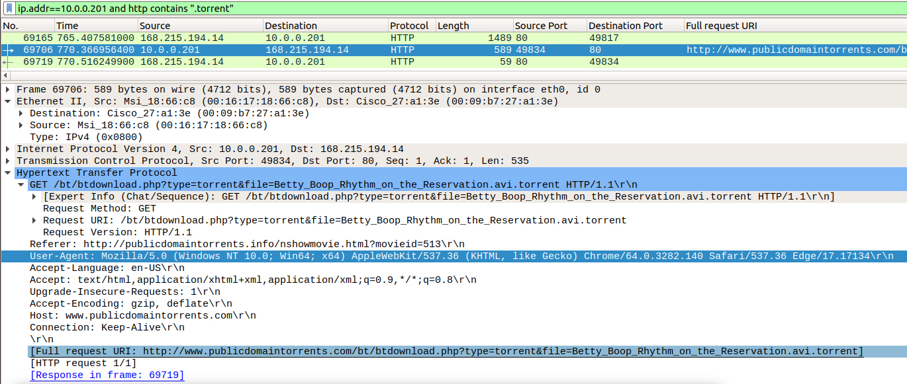

# Network Forensic Analysis Report

## Time Thieves 
You must inspect your traffic capture to answer the following questions:

1. What is the domain name of the users' custom site?

    FRANK-N-TED.COM (domain name of Domain Controller)

2. What is the IP address of the Domain Controller (DC) of the AD network?

    10.6.12.12

    We search for Kerberos traffic for these details, noting that the domain controller is the IP that appears as either source or destination for all Kerbros packets in the IP range.

    

    

    The question about the IP number in the instructions suggested that there was a webserver somewhere on this network. However, we established that there are no servers serving traffic on the standard ports for HTTP (80, 8080, 443)

    

    We search for HTTP get requests from the IP, to find download requests, and inspect the URI for executable file types.

   - Once you have found the file, export it to your Kali machine's desktop.

    

4. Upload the file to [VirusTotal.com](https://www.virustotal.com/gui/). 

    

5. What kind of malware is this classified as?

    trojan

---

## Vulnerable Windows Machine

1. Find the following information about the infected Windows machine:
    - Host name: ROTTERDAM-PC
    - IP address: 172.16.4.205
    - MAC address: 00:59:07:b0:63:a4

    When we search for Kerberos traffic in the network IP range, tho only IP other than the Domain Controller is 172.16.4.205

    
    
2. What is the username of the Windows user whose computer is infected?

    matthijs.devries

    We get the username from CNameString

    

3. What are the IP addresses used in the actual infection traffic?

    The remote server at 31.7.62.214 is sending and receieving Command-and-control traffic to the local machine 172.16.4.205 via HTTP post requests. 

    
    

    The remote server at 185.243.115.84 is recieving HTTP posts from the local machine 172.16.4.205 containing disguised screenshots of the desktop.
    

4. As a bonus, retrieve the desktop background of the Windows host.

    

    

    

---

## Illegal Downloads

1. Find the following information about the machine with IP address `10.0.0.201`:
    - MAC address: 00:16:17:18:66:c8
    - Windows username: elmer.blanco
    - OS version: Windows 10 

2. Which torrent file did the user download?

    Betty_Boop_Rhythm_on_the_Reservation.avi.torrent

    We search for Kerberos traffic and inspect CNameString for the username. We determine the OS version from the User-Agent in an HTTP request. Windows NT 10.0 is Windows 10, see last screenshot.

    

    If we hadn't been given the offending IP, we would search for torrent traffic to identify the IP addresses using bit torrent. We see in the results that the only IP in the range using bit torrent is 10.0.0.201

    

    To find the torrent file, we search for HTTP requests containing the .torrent file type.

    